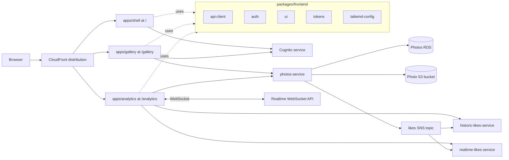

# AWS 09 - Microfrontend Architecture

This version keeps the backend microservices from AWS 07 and AWS 08, then splits the frontend into independently built route apps. The user experience is still one website, but the code ownership is now divided between a shell, a gallery app, and an analytics app.

This reworked AWS 09 also carries forward the route-app layout improvements that were previously mixed into the old AWS 11 material: each route app owns its own chrome, status surface, and local development entry point. Rekognition and image tagging are not part of this version; those arrive in AWS 10.



## What this version adds

- `apps/shell`, `apps/gallery`, and `apps/analytics` replace the single `apps/ui` application.
- The shell owns the deployed website infrastructure under `apps/shell/cdk`.
- Gallery and analytics are independently built and deployed into their own CloudFront prefixes.
- Shared browser code moves into `packages/frontend/*`.
- Backend event contracts move under `packages/backend/events`.
- Vite local development runs all route apps together while preserving route prefixes.
- CloudFront rewrites direct route refreshes to the correct app entry point.

The backend services remain independently deployable and keep the owner-local CDK layout:

```text
services/cognito-service/cdk
services/photos-service/cdk
services/historic-likes-service/cdk
services/realtime-likes-service/cdk
```

## Route ownership

The frontend is organised by user-facing route ownership:

```text
apps/shell
  /
  /profile
  /auth/callback
  shared navigation and website infrastructure

apps/gallery
  /gallery
  /gallery/upload
  photo browsing, preview, upload, and likes

apps/analytics
  /analytics
  /analytics/images/:imageId
  historic charts, realtime charts, tables, and browser push
```

Each route app can evolve independently while still sharing authentication, API clients, tokens, Tailwind configuration, and reusable UI components.

## Website deployment model

The website still uses one S3 bucket and one CloudFront distribution. The route apps are deployed into different prefixes:

```text
shell      -> /
gallery    -> /gallery/
analytics  -> /analytics/
```

The CloudFront Function in `apps/shell/cdk` keeps browser refreshes working:

```text
/                         -> /index.html
/gallery                  -> /gallery/index.html
/gallery/upload           -> /gallery/index.html
/analytics                -> /analytics/index.html
/analytics/images/:id     -> /analytics/index.html
```

That gives users a single site while preserving separate frontend build and deployment ownership.

## Shared packages

Frontend packages:

```text
packages/frontend/api-client
packages/frontend/auth
packages/frontend/tailwind-config
packages/frontend/tokens
packages/frontend/ui
```

Backend packages:

```text
packages/backend/events
```

The route apps import service clients from `@frontend/api-client` instead of each app hand-rolling fetch logic. Authentication state is centralised in `@frontend/auth`, while shared styling primitives live in the UI, token, and Tailwind packages.

## Backend services

AWS 09 keeps the same backend ownership introduced in AWS 07 and AWS 08:

- `services/cognito-service` owns Cognito and the post-confirmation integration.
- `services/photos-service` owns photos, uploads, likes, photo storage, and the like event publisher.
- `services/historic-likes-service` owns accumulated historic analytics.
- `services/realtime-likes-service` owns Valkey-backed realtime analytics and WebSocket browser push.

The services communicate through APIs and events. The frontend split does not collapse backend ownership back into a shared infrastructure project.

## Local workflow

Install dependencies from the monorepo folder:

```bash
cd monorepo
pnpm install
```

Generate route-app environment files from deployed SSM values:

```bash
pnpm run generate-env
```

Run the three frontend apps together:

```bash
pnpm run dev
```

The local development ports are:

```text
shell      http://localhost:5173
gallery    http://localhost:5174/gallery
analytics  http://localhost:5175/analytics
```

The shell Vite server proxies `/gallery` and `/analytics` to the route app servers, so you can usually work from:

```text
http://localhost:5173
http://localhost:5173/gallery
http://localhost:5173/analytics
```

Run checks:

```bash
pnpm run type-check
pnpm run build
```

## Deployment

Deploy everything:

```bash
cd monorepo
pnpm run deploy-everything
pnpm run generate-env
```

Deploy frontend apps independently:

```bash
pnpm run shell:deploy
pnpm run gallery:deploy
pnpm run analytics:deploy
```

Deploy backend services independently:

```bash
pnpm run cognito-service:deploy
pnpm run photos-service:deploy
pnpm run historic-likes-service:deploy
pnpm run realtime-likes-service:deploy
```

Destroy everything:

```bash
pnpm run destroy-everything
```

## Data and simulation

The same data workflow remains available:

```bash
pnpm run bootstrap-up
pnpm run data:reset
pnpm run data:seed
pnpm run simulator:start
```

Photos are loaded by `services/photos-service/scripts/src/init-images.ts`. By default it reads the shared `photos-to-upload` folder at the repository level; override with `PHOTOS_DIR` when needed.

## Repository shape

```text
monorepo/
  apps/
    shell/
      cdk/
      src/
    gallery/
      src/
    analytics/
      src/
  packages/
    backend/
      events/
    frontend/
      api-client/
      auth/
      tailwind-config/
      tokens/
      ui/
  scripts/
  services/
    cognito-service/
      cdk/
    photos-service/
      cdk/
    historic-likes-service/
      cdk/
    realtime-likes-service/
      cdk/
```

## Source material folded into this version

This reworked AWS 09 principally synthesizes the old AWS 10 microfrontend architecture material. It also pulls in the frontend layout improvements that had previously appeared in the old AWS 11 work, while intentionally leaving out the Rekognition and tagging feature set. The result is a clean progression: AWS 08 adds realtime likes, AWS 09 reorganises the frontend, and AWS 10 adds tagging.
