# AWS 09 - Microfrontend Architecture

## Introduction

AWS 09 keeps the AWS 08 backend exactly in the microservices style already established, then gives the frontend the same professional ownership model. The single `apps/ui` application is split into three independently built route apps: `apps/shell`, `apps/gallery`, and `apps/analytics`. Users still experience one website, but the codebase is now organised so separate teams can build, test, and deploy their own frontend apps without waiting for one large UI bundle to move as a unit.

This is a route-based microfrontend architecture. The shell app owns the root experience, profile, auth callback, CloudFront distribution, S3 website bucket, and shared environment generation. The gallery app owns `/gallery` and `/gallery/upload`. The analytics app owns `/analytics` and `/analytics/images/:imageId`. Each app is a real Vite/React application with its own build, deploy, invalidation, local dev port, and route base.

CloudFront is the composition layer. The shell deploys one CloudFront distribution in front of one private S3 website bucket. The shell bundle is uploaded to the bucket root, the gallery bundle is uploaded under `/gallery/`, and the analytics bundle is uploaded under `/analytics/`. A small CloudFront Function rewrites browser requests such as `/gallery/upload` to `/gallery/index.html` and `/analytics/images/123` to `/analytics/index.html`, so direct refreshes work just like they would in a single-page app.

This release deliberately does not use module federation or module federation 2.0. Module federation is useful when teams need to compose React components at runtime inside one page, but this application has clean route boundaries. Route-level microfrontends are simpler here: each app ships as static assets, CloudFront chooses the right app by URL path, no browser has to negotiate remote module versions, and a broken gallery deployment does not require the shell or analytics bundle to be rebuilt. Shared code still exists, but it is shared deliberately through workspace packages rather than loaded dynamically at runtime.

## Mermaid Diagram

```mermaid
%%{init: {"themeVariables": {"lineColor": "#ff1744", "edgeLabelBackground": "#334155"}, "themeCSS": ".edgeLabel rect { fill: #334155 !important; opacity: 1 !important; } .edgeLabel text, .edgeLabel span { fill: #f8fafc !important; color: #f8fafc !important; }"}}%%
flowchart LR
  browser[Browser UI]

  subgraph Frontend["<b>Frontend route apps</b>"]
    cloudfront[CloudFront distribution<br/>path routing and SPA rewrites]
    shell["Shell app<br/>apps/shell<br/>/"]
    gallery["Gallery app<br/>apps/gallery<br/>/gallery"]
    analytics["Analytics app<br/>apps/analytics<br/>/analytics"]
    frontendPackages["packages/frontend<br/>api-client, auth, tokens, ui, tailwind-config"]
  end

  subgraph ShellOwner["<b>Shell owner</b><br/>apps/shell"]
    shellCdk[Website CDK]
    shellEnv[env generation]
  end

  subgraph PhotosService["<b>Photos service owner</b><br/>services/photos-service"]
    photosCdk[Photos service CDK]
    photosApi[API Gateway + Express Lambda]
    postgres["PostgreSQL<br/>users, images, current likes"]
    images[S3 image storage + image CloudFront]
    signupConsumer[cognitoSignupConsumer]
    simulator[Simulator tick and reset endpoints]
  end

  subgraph PhotosEvents["<b>Photos event delivery</b>"]
    photosBus[PhotosEventBus]
    likesTopic[SNS LikesEventsTopic]
    historicQueue[SQS HistoricLikesQueue]
    realtimeQueue[SQS RealtimeLikesQueue]
  end

  subgraph CognitoService["<b>Cognito service owner</b><br/>services/cognito-service"]
    cognitoCdk[Cognito CDK]
    cognitoTrigger[Post-confirmation Lambda]
    cognitoBus[CognitoEventBus]
    userPool[Cognito user pool]
  end

  subgraph HistoricService["<b>Historic likes owner</b><br/>services/historic-likes-service"]
    historicCdk[Historic likes CDK]
    userProjection[User projection consumer]
    imageProjection[Image projection consumer]
    historicLikesConsumer[Like and reset consumer]
    historicApi[Public REST API + Lambda]
    dynamo[DynamoDB projections and historic like buckets]
  end

  subgraph RealtimeService["<b>Realtime likes owner</b><br/>services/realtime-likes-service"]
    realtimeCdk[Realtime likes CDK]
    realtimeLikesConsumer[Python like and reset consumer]
    realtimePushConsumer[Python push consumer]
    realtimeApi[Public REST API + Lambda]
    websocketConnect[WebSocket connect Lambda]
    websocketDisconnect[WebSocket disconnect Lambda]
    websocketApi[API Gateway WebSocket API]
    websocketConnections[DynamoDB connection IDs]
    valkey["Valkey (Redis-compatible cache)<br/>realtime circular buckets"]
  end

  subgraph BackendPackages["<b>Backend packages</b>"]
    backendEvents["packages/backend/events<br/>event contracts"]
  end

  subgraph Terminal["<b>Terminal-started simulator</b>"]
    terminal[simulator:start]
  end

  browser --> cloudfront
  cloudfront -- / --> shell
  cloudfront -- /gallery --> gallery
  cloudfront -- /analytics --> analytics

  shell --> frontendPackages
  gallery --> frontendPackages
  analytics --> frontendPackages
  shell --> userPool
  gallery --> userPool

  gallery --> photosApi
  analytics --> photosApi
  analytics --> historicApi
  analytics --> realtimeApi
  analytics <-->|WebSocket| websocketApi

  shellCdk -. deploys .-> cloudfront
  shellCdk -. deploys .-> shell
  shellEnv -. writes Vite env .-> shell
  shellEnv -. writes Vite env .-> gallery
  shellEnv -. writes Vite env .-> analytics
  photosCdk -. deploys .-> photosApi
  cognitoCdk -. deploys .-> userPool
  historicCdk -. deploys .-> historicApi
  realtimeCdk -. deploys .-> realtimeApi
  realtimeCdk -. deploys .-> websocketApi

  photosApi --> postgres
  photosApi --> images
  photosApi -- user and image events --> photosBus
  photosBus --> userProjection --> dynamo
  photosBus --> imageProjection --> dynamo

  cognitoTrigger -- user.created --> cognitoBus
  cognitoBus --> signupConsumer --> postgres

  photosApi -- like.created / like.deleted / likes.deleted.all --> likesTopic
  likesTopic --> historicQueue --> historicLikesConsumer --> dynamo
  likesTopic --> realtimeQueue --> realtimeLikesConsumer --> valkey
  likesTopic --> realtimePushConsumer --> websocketApi

  websocketApi --> websocketConnect --> websocketConnections
  websocketApi --> websocketDisconnect --> websocketConnections
  realtimePushConsumer --> websocketConnections

  historicApi --> dynamo
  realtimeApi --> valkey
  terminal --> simulator --> photosApi

  photosApi -. uses .-> backendEvents
  historicLikesConsumer -. uses .-> backendEvents

  classDef uiClass fill:#e8f3ff,stroke:#2563eb,color:#0f172a
  classDef photosClass fill:#fff4d6,stroke:#d97706,color:#0f172a
  classDef eventsClass fill:#f3e8ff,stroke:#7c3aed,color:#0f172a
  classDef historicClass fill:#dcfce7,stroke:#16a34a,color:#0f172a
  classDef realtimeClass fill:#fef3c7,stroke:#ca8a04,color:#0f172a
  classDef cognitoClass fill:#e0f2fe,stroke:#0284c7,color:#0f172a
  classDef simClass fill:#ffe4e6,stroke:#e11d48,color:#0f172a
  classDef cdkClass fill:#f8fafc,stroke:#64748b,color:#0f172a
  classDef packageClass fill:#f1f5f9,stroke:#475569,color:#0f172a
  class browser,cloudfront,shell,gallery,analytics,frontendPackages uiClass
  class photosApi,postgres,images,signupConsumer,simulator photosClass
  class photosBus,likesTopic,historicQueue,realtimeQueue eventsClass
  class userProjection,imageProjection,historicLikesConsumer,historicApi,dynamo historicClass
  class realtimeLikesConsumer,realtimePushConsumer,realtimeApi,websocketConnect,websocketDisconnect,websocketApi,websocketConnections,valkey realtimeClass
  class cognitoTrigger,cognitoBus,userPool cognitoClass
  class terminal simClass
  class shellCdk,shellEnv,photosCdk,cognitoCdk,historicCdk,realtimeCdk cdkClass
  class backendEvents packageClass

  style Frontend fill:#eff6ff,stroke:#2563eb,color:#0f172a
  style ShellOwner fill:#f8fafc,stroke:#64748b,color:#0f172a
  style PhotosService fill:#fff9e8,stroke:#d97706,color:#0f172a
  style PhotosEvents fill:#faf5ff,stroke:#7c3aed,color:#0f172a
  style HistoricService fill:#f0fdf4,stroke:#16a34a,color:#0f172a
  style RealtimeService fill:#fffbeb,stroke:#ca8a04,color:#0f172a
  style CognitoService fill:#f0f9ff,stroke:#0284c7,color:#0f172a
  style BackendPackages fill:#f8fafc,stroke:#475569,color:#0f172a
  style Terminal fill:#fff1f2,stroke:#e11d48,color:#0f172a
```



## Release Notes

- **The single UI becomes professional microfrontends.** AWS 08 had one `apps/ui` frontend. AWS 09 splits that into `apps/shell`, `apps/gallery`, and `apps/analytics`, so each user-facing area has its own package, source tree, build, route base, and deployment script.
- **Frontend teams can work independently.** The shell, gallery, and analytics apps can be developed on separate local ports, built separately, uploaded separately, and invalidated separately. A gallery change can be shipped with `pnpm run gallery:deploy`; an analytics change can be shipped with `pnpm run analytics:deploy`; shell infrastructure changes stay with `pnpm run shell:deploy`.
- **CloudFront becomes the frontend router.** One CloudFront distribution fronts one private S3 bucket. Requests for `/` load the shell app, requests under `/gallery` load the gallery app, and requests under `/analytics` load the analytics app. The user sees one website, but CloudFront quietly routes each path to the correct static bundle.
- **SPA refreshes work under every route app.** The CloudFront Function rewrites clean URLs without file extensions. `/gallery/upload` becomes `/gallery/index.html`; `/analytics/images/{imageId}` becomes `/analytics/index.html`; unknown root routes fall back to `/index.html`. That keeps deep links and browser refreshes working without a server-side frontend runtime.
- **No module federation is required.** AWS 09 does not use module federation or module federation 2.0. The route boundaries are strong enough that runtime component loading would add more complexity than value. This approach avoids remote module version negotiation, shared dependency drift, runtime loading failures, and cross-app release coupling.
- **Shared code moves into explicit frontend packages.** Common browser concerns are pulled into `packages/frontend`: `api-client` for service calls, `auth` for Cognito/session helpers, `ui` for shared components/styles, `tokens` for design tokens, and `tailwind-config` for consistent styling.
- **Backend event contracts move to a backend package.** Event contracts live under `packages/backend/events`, keeping backend event types away from browser-only packages and making the frontend/backend boundary easier to understand.
- **Local development mirrors production routing.** The shell dev server runs on port `5173` and proxies `/gallery` to the gallery app on `5174` and `/analytics` to the analytics app on `5175`. Developers can work in one route app while still clicking around as if CloudFront were serving the full website.
- **Route apps communicate through URLs and APIs.** The gallery links to `/analytics/images/:imageId`; analytics reloads the photo and chart state from service APIs. Apps do not pass React props across bundle boundaries, which keeps ownership and deployability clean.
- **The AWS08 backend remains intact.** Photos, historic likes, and the Python realtime likes service continue to run as independent backend services. AWS09 is about giving the browser side the same independence and team-friendly deployment model.

## How To Run

Most day-to-day work starts in the `monorepo` folder. The root scripts are thin wrappers around service-owned scripts, so you can either run the whole stack or step into one owner when you want to inspect something more closely.

**Install and local checks**

```bash
cd monorepo
pnpm install
pnpm run generate-env
pnpm run dev              # shell on :5173, gallery on :5174, analytics on :5175
pnpm run type-check
pnpm run build
```

**Deploy the backend services**

```bash
pnpm run bootstrap-up
pnpm run cognito-service:deploy
pnpm run photos-service:deploy
pnpm run historic-likes-service:deploy
pnpm run realtime-likes-service:deploy
```

**Deploy the UI**

```bash
pnpm run shell:deploy
pnpm run gallery:deploy
pnpm run analytics:deploy
pnpm run ui:url
```

**Deploy everything in the expected order**

```bash
pnpm run deploy-everything
```

**Seed, reset, and simulate activity**

```bash
pnpm run data:seed          # upload starter images and publish image events
pnpm run simulator:start    # create like/unlike traffic from terminal users
pnpm -C services/photos-service run simulator:latest
pnpm run data:reset         # clear photos data, historic projections, and Cognito test users
```

**Useful service tests**

```bash
pnpm -C services/photos-service run test:security
pnpm -C services/historic-likes-service run test:public-api
pnpm -C services/realtime-likes-service run test:public-api
```

**Tear down**

```bash
pnpm run destroy-everything
pnpm run bootstrap-down
```

## Microservices

### Cognito Service

#### Service Overview

The Cognito service owns sign-up, sign-in, hosted UI configuration, and the post-confirmation event that tells the rest of the system a user exists. It keeps authentication separate from the photo database while still letting app users appear in the gallery experience.

#### Commands

```bash
pnpm run cognito-service:deploy
pnpm -C services/cognito-service run data:reset
pnpm run cognito-service:destroy
```

#### Endpoints

Cognito is reached through its hosted UI and OAuth endpoints rather than the application REST APIs. A realistic deployed domain looks like:

```text
http://uptick-auth-a1b2c3d4.auth.eu-west-1.amazoncognito.com/login
http://uptick-auth-a1b2c3d4.auth.eu-west-1.amazoncognito.com/logout
http://uptick-auth-a1b2c3d4.auth.eu-west-1.amazoncognito.com/oauth2/token
```

#### Event Queues

**CognitoEventBus**

Subscribers: `photos-service` through `CognitoSignupQueue`.

Messages:

```text
user.created
```

#### Databases And Caches

Cognito owns the user pool. The photos service stores an app-facing user row after it receives the signup event.

#### SSM Parameters And Secrets

```text
/cognito/domain
/cognito/client-id
/cognito/user-pool-id
/cognito/events/event-bus-name
```

### Photos Service

#### Service Overview

The photos service owns the photo catalogue, image uploads, current like state, simulator endpoints, and the outbound domain events used by the analytics services. It is the main user-facing backend for the gallery.

#### Commands

```bash
pnpm run photos-service:deploy
pnpm -C services/photos-service run database:migrate
pnpm -C services/photos-service run database:reset
pnpm -C services/photos-service run data:seed
pnpm -C services/photos-service run data:reset
pnpm -C services/photos-service run simulator:start
pnpm -C services/photos-service run test:security
pnpm run photos-service:destroy
```

#### Endpoints

```text
http://photos-api-a1b2c3d4.execute-api.eu-west-1.amazonaws.com/health
http://photos-api-a1b2c3d4.execute-api.eu-west-1.amazonaws.com/gallery-photos
http://photos-api-a1b2c3d4.execute-api.eu-west-1.amazonaws.com/images/{imageId}
http://photos-api-a1b2c3d4.execute-api.eu-west-1.amazonaws.com/auth/photos/gallery
http://photos-api-a1b2c3d4.execute-api.eu-west-1.amazonaws.com/auth/photos/presigned-url
http://photos-api-a1b2c3d4.execute-api.eu-west-1.amazonaws.com/auth/photos/{imageId}/like
http://photos-api-a1b2c3d4.execute-api.eu-west-1.amazonaws.com/auth/users/me
http://photos-api-a1b2c3d4.execute-api.eu-west-1.amazonaws.com/auth/users/me/nickname
http://photos-api-a1b2c3d4.execute-api.eu-west-1.amazonaws.com/auth/admin/member
http://photos-api-a1b2c3d4.execute-api.eu-west-1.amazonaws.com/auth/admin/photos
http://photos-api-a1b2c3d4.execute-api.eu-west-1.amazonaws.com/simulation/tick
http://photos-api-a1b2c3d4.execute-api.eu-west-1.amazonaws.com/simulation/likes
```

The `/auth/...` routes expect a signed-in user. The `/simulation/...` routes are for repeatable demos and use the simulator secret rather than a browser session.

#### Event Queues

**PhotosEventBus**

Subscribers: `historic-likes-service` user projection consumer and image projection consumer.

Messages:

```text
user.created
user.updated
user.deleted
image.created
image.updated
image.deleted
```

**LikesEventsTopic**

Subscribers: `historic-likes-service` through `HistoricLikesQueue`, `realtime-likes-service` through `RealtimeLikesQueue`, and the realtime push Lambda.

Messages:

```text
like.created
like.deleted
likes.deleted.all
```

**CognitoSignupQueue**

Owner: photos service. Subscriber: `cognitoSignupConsumer` inside the photos service.

Messages:

```text
user.created
```

#### Databases And Caches

```text
registered_user
images
image_likes
```

PostgreSQL is the source of truth for app users, images, and current likes. Image files live in S3 and are served through CloudFront.

#### SSM Parameters And Secrets

```text
/services/photos-service/base-url
/photos/rds/secret-arn
/photos/images/bucket-name
/photos/images/distribution-url
/photos/events/event-bus-name
/photos/events/likes-topic-arn
/photos/cognito-signup/queue-url
/simulator/secret
```

Consumed parameters:

```text
/cognito/user-pool-id
/cognito/events/event-bus-name
```

### Historic Likes Service

#### Service Overview

The historic likes service turns photo, user, and like events into DynamoDB read models for longer-running analytics. The browser reads charts from this service instead of asking the photos database to perform reporting work.

#### Commands

```bash
pnpm run historic-likes-service:deploy
pnpm -C services/historic-likes-service run data:reset
pnpm -C services/historic-likes-service run test:public-api
pnpm run historic-likes-service:destroy
```

#### Endpoints

```text
http://historic-likes-api-e5f6g7h8.execute-api.eu-west-1.amazonaws.com/public/health
http://historic-likes-api-e5f6g7h8.execute-api.eu-west-1.amazonaws.com/public/photo-likes
http://historic-likes-api-e5f6g7h8.execute-api.eu-west-1.amazonaws.com/public/photo-likes?imageId={imageId}
http://historic-likes-api-e5f6g7h8.execute-api.eu-west-1.amazonaws.com/public/author-likes
http://historic-likes-api-e5f6g7h8.execute-api.eu-west-1.amazonaws.com/public/author-likes?authorUserId={userId}
```

#### Event Queues

**HistoricLikesQueue**

Owner: historic likes service. Publisher path: `photos-service` -> `LikesEventsTopic` -> `HistoricLikesQueue`.

Messages:

```text
like.created
like.deleted
likes.deleted.all
```

**Projection Queues**

Owner: historic likes service. Publisher path: `photos-service` -> `PhotosEventBus` -> projection consumers.

Messages:

```text
user.created
user.updated
user.deleted
image.created
image.updated
image.deleted
```

#### Databases And Caches

```text
HistoricLikesUsersTable
HistoricLikesImagesTable
HistoricPhotoBucketLikesTable
HistoricAuthorBucketLikesTable
```

The projection tables keep enough user and image context for analytics screens. The bucket tables hold accumulated like deltas by photo and by author.

#### SSM Parameters And Secrets

```text
/historic-likes/users-table-name
/historic-likes/images-table-name
/historic-likes/photo-bucket-likes-table-name
/historic-likes/author-bucket-likes-table-name
/historic-likes/queue-url
/services/historic-likes-service/base-url
```

Consumed parameters:

```text
/photos/events/event-bus-name
/photos/events/likes-topic-arn
```

### Realtime Likes Service

#### Service Overview

The realtime likes service is a Python Lambda service that keeps short, rolling like buckets in Valkey (Redis-compatible cache). It also stores WebSocket connection IDs so the analytics UI can refresh quickly when like events arrive.

#### Commands

```bash
pnpm run realtime-likes-service:deploy
pnpm -C services/realtime-likes-service run setup
pnpm -C services/realtime-likes-service run test:public-api
pnpm run realtime-likes-service:destroy
```

#### Endpoints

```text
http://realtime-likes-api-i9j0k1l2.execute-api.eu-west-1.amazonaws.com/public/health
http://realtime-likes-api-i9j0k1l2.execute-api.eu-west-1.amazonaws.com/public/realtime-likes?imageId={imageId}&authorUserId={userId}
http://realtime-likes-ws-m3n4o5p6.execute-api.eu-west-1.amazonaws.com/production
```

#### Event Queues

**RealtimeLikesQueue**

Owner: realtime likes service. Publisher path: `photos-service` -> `LikesEventsTopic` -> `RealtimeLikesQueue`.

Messages:

```text
like.created
like.deleted
likes.deleted.all
```

**Realtime Push Subscription**

Owner: realtime likes service. Publisher path: `photos-service` -> `LikesEventsTopic` -> push Lambda -> WebSocket API.

Messages:

```text
like.created
like.deleted
likes.deleted.all
```

#### Databases And Caches

```text
Valkey (Redis-compatible cache) realtime buckets
RealtimeWebSocketConnections DynamoDB table
```

Valkey (Redis-compatible cache) keeps circular 5-second buckets for images and authors. DynamoDB stores active WebSocket connection IDs.

#### SSM Parameters And Secrets

```text
/realtime-likes/queue-url
/services/realtime-likes-service/base-url
/services/realtime-likes-service/websocket-url
```

Consumed parameters:

```text
/photos/events/likes-topic-arn
```

## Microfrontend Apps

### Shell App

#### App Overview

The shell app owns `/`, `/profile`, `/auth/callback`, shared navigation, auth setup, and the CloudFront/S3 website infrastructure. It is the only frontend app with CDK because it owns the shared website bucket, CloudFront distribution, route rewrite function, and SSM parameters used by the other route apps.

#### Commands

```bash
pnpm run shell:deploy
pnpm -C apps/shell run deploy:infra
pnpm -C apps/shell run generate-env
pnpm -C apps/shell run url
pnpm run shell:destroy
```

#### SSM Parameters Consumed

```text
/cognito/domain
/cognito/client-id
/cognito/user-pool-id
/services/photos-service/base-url
/services/historic-likes-service/base-url
/services/realtime-likes-service/base-url
/services/realtime-likes-service/websocket-url
```

#### SSM Parameters Stored

```text
/website/bucket-name
/website/distribution-id
/website/distribution-url
```

### Gallery App

#### App Overview

The gallery app owns `/gallery` and `/gallery/upload`. It handles browsing, searching, uploading, liking, and links into analytics when a user wants more detail. It builds with `base: "/gallery/"`, uploads only to the `gallery/` S3 prefix, and can be deployed without rebuilding shell or analytics.

#### Commands

```bash
pnpm run gallery:deploy
pnpm -C apps/gallery run generate-env
pnpm -C apps/gallery run build
pnpm -C apps/gallery run upload
pnpm -C apps/gallery run invalidate-cloudfront
```

#### SSM Parameters Consumed

```text
/website/bucket-name
/website/distribution-id
/services/photos-service/base-url
/cognito/client-id
/cognito/user-pool-id
```

### Analytics App

#### App Overview

The analytics app owns `/analytics` and `/analytics/images/:imageId`. It combines photo details, historic like buckets, realtime like buckets, and WebSocket refresh notifications. It builds with `base: "/analytics/"`, uploads only to the `analytics/` S3 prefix, and can be deployed without touching shell or gallery.

#### Commands

```bash
pnpm run analytics:deploy
pnpm -C apps/analytics run generate-env
pnpm -C apps/analytics run build
pnpm -C apps/analytics run upload
pnpm -C apps/analytics run invalidate-cloudfront
```

#### SSM Parameters Consumed

```text
/website/bucket-name
/website/distribution-id
/services/photos-service/base-url
/services/historic-likes-service/base-url
/services/realtime-likes-service/base-url
/services/realtime-likes-service/websocket-url
```

## Troubleshooting

- If the UI has empty API URLs, run the relevant `generate-env` script after backend deployment.
- If sign-in works but the app cannot find the user profile, run `pnpm run data:seed` or sign up again so the Cognito signup event reaches the photos service.
- If analytics are empty after seeding, wait a few seconds for SQS/Lambda consumers, then run the public API test for the affected service.
- If a reset appears partial, run `pnpm run data:reset` from the root so photos, historic likes, and Cognito are cleared together.
- If CloudFormation says a stack already exists, destroy the owner stack from its package script and redeploy in dependency order.
- If realtime charts stay flat, check the `RealtimeLikesQueue`, the Valkey (Redis-compatible cache) connection settings, and the WebSocket URL written to SSM.
- If a direct refresh under `/gallery` or `/analytics` returns a 404, redeploy the shell infrastructure so the CloudFront function and SPA rewrites are current.
- If a route app deploy appears to work but old assets are still loading, run that app's invalidate script. Gallery invalidates `/gallery` and `/gallery/*`; analytics invalidates `/analytics` and `/analytics/*`; shell invalidates the whole distribution.

## Interesting Code Snippets New To This Release

### Python Realtime Buckets

```py
BUCKET_COUNT = 20
SECONDS_PER_BUCKET = 5
body = {
    'image': image_likes.chart(query['imageId']),
    'author': author_likes.chart(query['authorUserId']),
}
```

Realtime analytics are intentionally short-lived. The historic service keeps the long-running aggregate; Valkey (Redis-compatible cache) keeps the moving window.

### Route Apps Deploy Independently

```text
shell      -> /
gallery    -> /gallery/
analytics  -> /analytics/
```

The apps share packages and a CloudFront distribution, but each route bundle can be built and uploaded on its own. This is the key microfrontend move in AWS 09: route ownership, independent deploys, and URL-based composition.

### CloudFront Route Rewrites

```js
if (uri === "/gallery" || uri.indexOf("/gallery/") === 0 && uri.indexOf(".") === -1) {
  request.uri = "/gallery/index.html";
}

if (uri === "/analytics" || uri.indexOf("/analytics/") === 0 && uri.indexOf(".") === -1) {
  request.uri = "/analytics/index.html";
}
```

CloudFront chooses the right frontend app by URL path before S3 is asked for an object. That gives the application clean microfrontend routing without a Node frontend server and without module federation.

### No Module Federation Runtime

```text
browser URL -> CloudFront path rewrite -> route app index.html -> app-owned bundle
```

The route apps are composed at the CDN and URL level, not by loading remote React modules into one runtime. For this project that is a better fit: releases are simpler, each app owns its route surface, shared code is versioned through workspace packages, and runtime coupling stays low.

### Event Payloads Are Shared Contracts

```text
like.created
like.deleted
likes.deleted.all
```

The photos service publishes like events once. Historic and realtime services decide for themselves how to store and serve those events.
