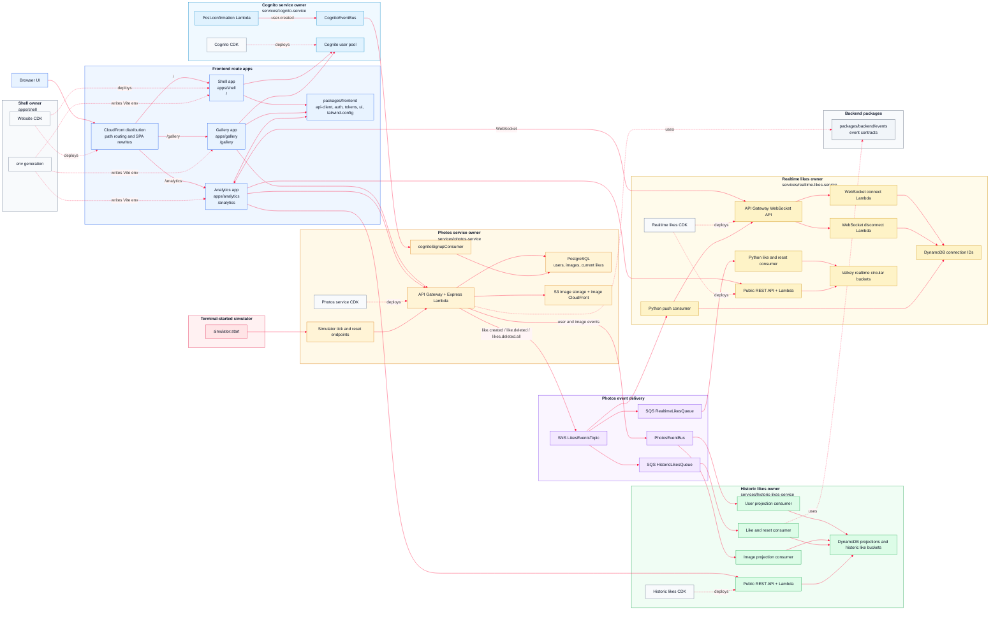

# AWS 09 - Microfrontend Architecture

This reworked version keeps the independently deployable backend microservices from AWS 07 and AWS 08, then splits the browser experience into independently built route apps. The user still sees one website, but ownership is now divided between a shell app, a gallery app, and an analytics app.

The architectural baseline from the previous reworked sections stays in place: every service owns its runtime code, operational scripts, and CDK infrastructure. The former course `core-service` has been repatriated into `photos-service`, so photos, users, current likes, image storage, seed data, simulator endpoints, and the outbound photos event stream all live under `services/photos-service`.

This reworked AWS 09 also carries forward the route-app layout improvements that were previously mixed into the old AWS 11 material: each route app owns its own chrome, status surface, route base, and local development entry point. Rekognition and image tagging are not part of this version; those arrive in AWS 10.

## Architecture



## What This Version Teaches

This version combines the realtime likes architecture from AWS 08 with the microfrontend route-app split from the old AWS 10 material, updated for the reworked service-owned backend:

- shell, gallery, and analytics route apps instead of one `apps/ui` application
- one CloudFront distribution serving independently uploaded frontend bundles
- CloudFront path routing and SPA rewrites for direct browser refreshes
- route-app local development with Vite proxies that mimic CloudFront routing
- shared browser-only packages under `packages/frontend`
- backend event contracts under `packages/backend/events`
- service-local CDK for Cognito, photos, historic likes, realtime likes, and shell hosting
- SNS fan-out from the photos service `LikesEventsTopic` to multiple independent consumers
- EventBridge projection streams for users and images
- historic analytics in DynamoDB and realtime analytics in Valkey
- WebSocket browser push that tells the analytics app when to refresh
- command-driven deployments with independent frontend and backend deploy targets

This version deliberately does not introduce image tagging or Rekognition. The finished progression is: AWS 08 adds realtime likes, AWS 09 reorganises the frontend into route apps, and AWS 10 adds tagging.

## Deployable Owners

| Owner | Path | Owns |
| --- | --- | --- |
| Shell app | `monorepo/apps/shell` | Root route, navigation, profile, auth callback, website hosting CDK, env generation, CloudFront distribution, S3 website bucket |
| Gallery app | `monorepo/apps/gallery` | `/gallery`, `/gallery/upload`, photo browsing, search, preview, upload, and current like actions |
| Analytics app | `monorepo/apps/analytics` | `/analytics`, `/analytics/images/:imageId`, historic charts, realtime charts, tables, and WebSocket refresh handling |
| Cognito service | `monorepo/services/cognito-service` | Cognito user pool, hosted UI domain, app client, post-confirmation Lambda, Cognito event bus, Cognito reset |
| Photos service | `monorepo/services/photos-service` | Express API, RDS, S3, image CloudFront distribution, photos event bus, SNS likes topic, Cognito signup ingest, seed, simulator, API tests |
| Historic likes service | `monorepo/services/historic-likes-service` | DynamoDB projections, historic like aggregates, SQS consumers, public historic likes API, historic reset and API tests |
| Realtime likes service | `monorepo/services/realtime-likes-service` | Python Lambdas, Valkey buckets, realtime SQS consumer, SNS push consumer, REST API, WebSocket API, connection storage, public API tests |
| Shared frontend packages | `monorepo/packages/frontend/*` | Browser API client, auth helpers, design tokens, Tailwind config, shared UI styles and components |
| Shared backend events | `monorepo/packages/backend/events` | Cross-service event source, detail type, and payload contracts |

Every deployable owner has its own CDK folder where it owns infrastructure:

```text
monorepo/apps/shell/cdk
monorepo/services/cognito-service/cdk
monorepo/services/photos-service/cdk
monorepo/services/historic-likes-service/cdk
monorepo/services/realtime-likes-service/cdk
```

There is no central root CDK app.

## Route Ownership

The frontend is organised around user-facing route ownership:

```text
apps/shell
  /
  /profile
  /auth/callback
  shared navigation, theme controls, auth frame, and website infrastructure

apps/gallery
  /gallery
  /gallery/upload
  photo browsing, search, preview, upload, and likes

apps/analytics
  /analytics
  /analytics/images/:imageId
  historic charts, realtime charts, table views, and browser push
```

The route apps communicate through URLs and service APIs. The shell links to `/gallery` and `/analytics` with normal browser navigation. The gallery links to `/analytics/images/:imageId` so analytics can reconstruct the page from the URL and the photos API instead of receiving React props from gallery.

Each route app can evolve independently while sharing authentication, API clients, tokens, Tailwind configuration, and reusable UI components.

## Website Deployment Model

The website uses one S3 bucket and one CloudFront distribution. The route apps are built separately and uploaded into different prefixes:

```text
shell      -> /
gallery    -> /gallery/
analytics  -> /analytics/
```

Expected object layout:

```text
s3://website-bucket/index.html
s3://website-bucket/assets/*

s3://website-bucket/gallery/index.html
s3://website-bucket/gallery/assets/*

s3://website-bucket/analytics/index.html
s3://website-bucket/analytics/assets/*
```

The CloudFront Function in `apps/shell/cdk` keeps browser refreshes working:

```text
/                         -> /index.html
/gallery                  -> /gallery/index.html
/gallery/upload           -> /gallery/index.html
/analytics                -> /analytics/index.html
/analytics/images/:imageId
                          -> /analytics/index.html
```

This gives users a single site while preserving separate frontend build and deployment ownership. Shell, gallery, and analytics can be deployed independently after frontend-only changes.

## Local Frontend Routing

The root `dev` script first refreshes Vite env files, then starts all three Vite dev servers in parallel:

```json
{
  "predev": "pnpm run generate-env",
  "generate-env": "pnpm -C apps/shell run generate-env && pnpm -C apps/gallery run generate-env && pnpm -C apps/analytics run generate-env",
  "dev": "pnpm --parallel -F @apps/shell -F @apps/gallery -F @apps/analytics dev"
}
```

The apps use fixed local ports:

```text
shell      5173
gallery    5174
analytics  5175
```

`apps/shell/vite.config.ts` is the integrated local entry point. It serves the shell on port `5173` and proxies route-app paths to the other local Vite servers:

```text
/gallery    -> http://localhost:5174
/analytics  -> http://localhost:5175
```

The proxy also rewrites bare route prefixes:

```text
/gallery    -> /gallery/
/analytics  -> /analytics/
```

Those rewrites matter because the route apps are configured with path bases in their own Vite configs:

```text
apps/gallery     base: /gallery/
apps/analytics   base: /analytics/
```

The local shell therefore behaves like CloudFront path routing: the browser can stay on `http://localhost:5173`, while `/gallery` and `/analytics` are served by their own independently running apps.

Useful local URLs:

```text
shell      http://localhost:5173
gallery    http://localhost:5173/gallery
analytics  http://localhost:5173/analytics
```

You can also work on route apps in isolation:

```bash
pnpm -C apps/gallery run dev
pnpm -C apps/analytics run dev
```

Then open:

```text
http://localhost:5174/gallery
http://localhost:5175/analytics
```

## Shared Packages

Frontend packages:

```text
packages/frontend/api-client
packages/frontend/auth
packages/frontend/tailwind-config
packages/frontend/tokens
packages/frontend/ui
```

Backend packages:

```text
packages/backend/events
```

The route apps import service clients from `@frontend/api-client` instead of each app hand-rolling fetch logic. Authentication state is centralised in `@frontend/auth`, while shared styling primitives live in the UI, token, and Tailwind packages.

The event package lives under `packages/backend` because this version does not introduce a package that is intentionally shared across browser and backend runtimes.

Tailwind entry points:

```text
packages/frontend/ui/src/styles.css
apps/shell/src/index.css
apps/gallery/src/index.css
apps/analytics/src/index.css
```

Each app owns its own Tailwind source list so the independent route-app builds only scan the files they need.

## Event Model

The system uses EventBridge for service-owned projection streams and SNS for fan-out like events.

**Cognito signup events**

```text
Cognito post-confirmation Lambda
  -> CognitoEventBus
    -> CognitoSignupQueue
      -> photos-service cognitoSignupConsumer
        -> Postgres registered_user
```

Cognito owns authentication and publishes `user.created` with source `uptick.cognito`. The photos service owns the Postgres write model, so it consumes the event and inserts or updates `registered_user`.

New Cognito users are projected into the photos service asynchronously through EventBridge and SQS. The profile page retries profile loading briefly so the redirect after signup does not fail if the backend projection is still completing.

**Photos projection events**

```text
photos-service
  -> PhotosEventBus
    -> historic-likes user projection queue
    -> historic-likes image projection queue
      -> DynamoDB read models
```

The photos service publishes projection events with source `uptick.photos`:

```text
user.created
user.updated
user.deleted
image.created
image.updated
image.deleted
```

The historic likes service builds DynamoDB user and image projections from that stream. Those projections let the analytics app understand authors and photos without reaching back into the photos service database.

**Like events**

```text
photos-service
  -> SNS LikesEventsTopic
    -> SQS HistoricLikesQueue
      -> historic-likes like and reset consumer
    -> SQS RealtimeLikesQueue
      -> realtime-likes Python like and reset consumer
    -> realtime-likes Python push consumer
        -> WebSocket API
          -> Analytics app
```

Like events use SNS because independent services can subscribe to the same stream without the photos service knowing their internal storage choices. The events that drive both likes services are:

```text
like.created
like.deleted
likes.deleted.all
```

`like.created` and `like.deleted` update current analytics. `likes.deleted.all` is published by the simulator reset path and tells the historic and realtime services to clear their own read models.

## Realtime Likes Flow

1. A user likes or unlikes a photo through the gallery app.
2. `photos-service` records the command in Postgres.
3. After the transaction commits, `photos-service` publishes a like event to the likes SNS topic.
4. `historic-likes-service` consumes the event and updates accumulated historic read models in DynamoDB.
5. `realtime-likes-service` consumes the same event and updates recent time buckets in Valkey.
6. The realtime push consumer observes the like stream and sends lightweight WebSocket messages to connected browsers.
7. Browsers refresh the realtime chart data through the realtime REST API.

The WebSocket messages are intentionally small. They are invalidation messages, not chart payloads.

```json
{
  "type": "realtime-bucket-changed"
}
```

```json
{
  "type": "likes-reset"
}
```

A bucket-change message tells the analytics app to refetch chart data. A reset message tells it to clear or refresh the visible chart state.

## Data Ownership

**Photos service Postgres tables**

```text
registered_user
images
image_likes
```

Postgres is the source of truth for users known to the app, uploaded image metadata, and the current like state. `image_likes` stores the current relationship between a user and a photo:

```sql
CREATE TABLE IF NOT EXISTS image_likes (
    user_sub VARCHAR(255) NOT NULL,
    image_id INT NOT NULL,
    created_at TIMESTAMP DEFAULT CURRENT_TIMESTAMP,
    PRIMARY KEY (user_sub, image_id)
);
```

**Historic likes DynamoDB tables**

```text
UsersProjectionTable
ImagesProjectionTable
HistoricPhotoBucketLikes
HistoricAuthorBucketLikes
```

The projection tables hold the latest user and image read models. The aggregate tables hold sparse historic like buckets for images and authors.

**Realtime likes storage**

```text
Valkey realtime buckets
DynamoDB WebSocket connection table
```

Valkey holds recent image and author like buckets. DynamoDB stores active WebSocket connection IDs so the push consumer can notify connected browsers.

## Realtime Buckets

The realtime service stores short-window activity in Valkey. It tracks two views for the selected photo:

```text
image:{imageId}
author:{authorUserId}
```

Each key is a circular hash of recent buckets. The finished browser-push version uses 5-second buckets so realtime and historic reset demos line up cleanly. Each bucket field stores the bucket start and count:

```text
bucketStart:count
```

Example:

```text
1718294400:12
```

When the same bucket slot comes around again, old data is replaced. The realtime service is only the recent activity lens; the historic service remains responsible for accumulated likes over longer periods.

## Service APIs

### Photos service

The photos service is an Express app adapted to Lambda with `@codegenie/serverless-express`.

Public routes:

```text
GET    /public/health
GET    /public/gallery-photos
GET    /public/images/:imageId
POST   /public/simulation/tick
DELETE /public/simulation/likes
```

Authenticated routes:

```text
GET    /auth/photos/gallery
POST   /auth/photos/presigned-url
POST   /auth/photos/:imageId/like
GET    /auth/users/me
PUT    /auth/users/me/nickname
GET    /auth/admin/member
DELETE /auth/admin/photos
```

Anonymous users use `GET /public/gallery-photos`. Signed-in users use `GET /auth/photos/gallery`, which adds `likedByCurrentUser` to each photo where appropriate.

Toggling a like uses:

```text
POST /auth/photos/{imageId}/like
```

It returns the new current state:

```json
{
  "liked": true
}
```

`GET /public/images/:imageId` lets the analytics route reconstruct image context from `/analytics/images/:imageId` without depending on React state from the gallery app.

### Historic likes service

The historic likes service has small direct Lambda handlers behind API Gateway.

Public routes:

```text
GET /public/health
GET /public/photo-likes?imageId=<image-id>
GET /public/author-likes?userId=<author-user-id>
GET /public/historic-likes
```

With an ID, each endpoint returns chart data for one photo or one author. Missing buckets are filled with zero so the UI can render stable charts.

### Realtime likes service

The realtime likes service exposes a public read API and a WebSocket endpoint:

```text
GET /public/health
GET /public/realtime-likes?imageId=<image-id>&authorUserId=<author-user-id>
WSS realtime likes browser push endpoint
```

Example realtime API response:

```json
{
  "image": [{ "label": "T-55", "likes": 0 }],
  "author": [{ "label": "T-55", "likes": 0 }]
}
```

The browser talks to three service endpoints:

- the photos service for gallery, auth, uploads, simulator commands, and current like state
- the historic likes service for accumulated chart data
- the realtime likes service for short-window chart data and WebSocket refresh messages

## UI Behaviour

The route-app UI keeps the gallery workflow from AWS 07 and the realtime analytics workflow from AWS 08:

- anonymous users can browse and search photos
- signed-in users can like and unlike photos
- a filled heart means the current user has liked the photo
- upload and profile links appear only when signed in
- `/gallery/upload` owns image upload
- each gallery tile links to image analytics
- `/analytics` shows analytics entry points
- `/analytics/images/:imageId` shows analytics for a selected photo
- chart mode shows historic author likes, historic image likes, realtime author likes, and realtime image likes
- table mode shows the same underlying data in readable tables
- historic charts are accumulated line charts
- realtime charts are short-window bucket charts
- author and image charts in each pair share the same y-axis scale
- charts use simple integer y-axis labels and no visible time labels
- the analytics app opens a WebSocket connection while an analytics route is visible
- realtime bucket-change push messages refresh chart data
- reset push messages clear the visible chart state

The UI reads the public historic and realtime service APIs directly from the browser. Those chart calls do not require a Cognito token.

## Python Realtime Service

The realtime likes service is a Python service inside the existing pnpm/CDK monorepo. The Lambda handlers under `services/realtime-likes-service/src` are Python modules, while its infrastructure remains CDK TypeScript.

The setup script lives at:

```text
services/realtime-likes-service/scripts/setup_python.py
```

It runs automatically before service type-checking or deployment. It:

1. finds a suitable Python installation
2. creates `.venv` if it does not already exist
3. installs dependencies from `requirements.txt` if that file exists
4. compile-checks the Python source code

The TypeScript-to-Python equivalents are:

| TypeScript | Python |
| --- | --- |
| `package.json` | `requirements.txt` |
| `pnpm install` | `pip install -r requirements.txt` |
| `node_modules` | `.venv` |
| `tsc --noEmit` | `python -m compileall src` |
| `export async function handler()` | `def handler()` |

You do not normally need to activate the virtual environment manually. The service scripts do that setup work for deployment and checks.

## Seed Data And Simulator

Seed photos live at the repository root:

```text
photos-to-upload
```

The seed script is owned by the photos service:

```text
monorepo/services/photos-service/scripts/src/init-images.ts
```

It:

1. reads the image bucket name from SSM at `/photos/images/bucket-name`
2. reads local files from `../photos-to-upload` relative to the repository root through the service script default
3. creates seed users
4. uploads photos to S3
5. inserts or updates rows in Postgres
6. publishes matching `user.created` and `image.created` events to `PhotosEventBus`

The reworked seed model creates artwork authors and simulator viewers. Artwork is assigned to `author-*` users, and simulator activity uses `viewer-*` users.

Run seeding from the monorepo:

```bash
cd monorepo
pnpm run data:seed
```

Override the photo folder if needed:

```bash
PHOTOS_DIR=/absolute/path/to/photos pnpm -C services/photos-service run data:seed
```

Start the simulator from the monorepo:

```bash
pnpm run simulator:start
```

The simulator:

1. clears current Postgres likes by calling the simulator reset endpoint
2. publishes a `likes.deleted.all` event
3. calls `POST /public/simulation/tick` on a short interval
4. creates likes for random unliked viewer/photo pairs
5. stops when the tick limit is reached or no unliked pairs remain

Use `data:reset` when you want to clear the full deployed environment. Use `simulator:start` when you only want fresh like activity for charts.

## SSM Parameters

The deployed services communicate through service-owned SSM parameters:

```text
/photos/events/event-bus-name
/photos/events/likes-topic-arn
/photos/images/bucket-name
/photos/images/distribution-url
/photos/rds/secret-arn
/photos/cognito-signup/queue-url

/cognito/domain
/cognito/client-id
/cognito/user-pool-id
/cognito/events/event-bus-name

/historic-likes/users-table-name
/historic-likes/images-table-name
/historic-likes/photo-bucket-likes-table-name
/historic-likes/author-bucket-likes-table-name
/historic-likes/queue-url

/realtime-likes/queue-url
/services/photos-service/base-url
/services/historic-likes-service/base-url
/services/realtime-likes-service/base-url
/services/realtime-likes-service/websocket-url
```

The route-app env generation script reads the public service URLs and Cognito settings from SSM and writes Vite `.env` files for `apps/shell`, `apps/gallery`, and `apps/analytics`.

## Local Workflow

Install dependencies from the monorepo folder:

```bash
cd monorepo
pnpm install
```

Bring up local database support services:

```bash
pnpm run bootstrap-up
```

Generate route-app environment files from deployed SSM values:

```bash
pnpm run generate-env
```

Run the three frontend apps together:

```bash
pnpm run dev
```

Type-check and build the workspace:

```bash
pnpm run type-check
pnpm run build
```

Run service API checks after deployment:

```bash
pnpm -C services/photos-service run test:security
pnpm -C services/historic-likes-service run test:public-api
pnpm -C services/realtime-likes-service run test:public-api
```

Clean package artifacts:

```bash
pnpm run package-cleanup
```

## Deployment

Deploy everything:

```bash
cd monorepo
pnpm install
pnpm run deploy-everything
pnpm run data:seed
```

`deploy-everything`:

1. deploys shell website hosting infrastructure from `apps/shell/cdk`
2. deploys Cognito and the post-confirmation trigger from `services/cognito-service/cdk`
3. deploys `photos-service-stack` from `services/photos-service/cdk`, then runs database migrations
4. deploys `historic-likes-service-stack` from `services/historic-likes-service/cdk`
5. deploys `realtime-likes-service-stack` from `services/realtime-likes-service/cdk`
6. generates env values, builds, uploads, and invalidates the shell app
7. generates env values, builds, uploads, and invalidates the gallery app
8. generates env values, builds, uploads, and invalidates the analytics app

Deploy Cognito before the photos service. The photos service imports `/cognito/user-pool-id` and `/cognito/events/event-bus-name`.

The photos service stack is the slow step on a cold account because it creates Aurora and CloudFront resources. Allow 30 to 45 minutes.

After deployment:

```bash
pnpm run type-check
pnpm -C services/photos-service run test:security
pnpm -C services/historic-likes-service run test:public-api
pnpm -C services/realtime-likes-service run test:public-api
pnpm run ui:url
```

Deploy frontend apps independently:

```bash
pnpm run shell:deploy
pnpm run gallery:deploy
pnpm run analytics:deploy
```

Deploy backend services independently:

```bash
pnpm run cognito-service:deploy
pnpm run photos-service:deploy
pnpm run historic-likes-service:deploy
pnpm run realtime-likes-service:deploy
```

Destroy backend services independently:

```bash
pnpm run realtime-likes-service:destroy
pnpm run historic-likes-service:destroy
pnpm run photos-service:destroy
pnpm run cognito-service:destroy
```

Destroy shell hosting:

```bash
pnpm run shell:destroy
```

Destroy everything:

```bash
pnpm run destroy-everything
```

## Data Reset

Reset deployed data back to a clean baseline:

```bash
pnpm run data:reset
pnpm run data:seed
```

`data:reset` delegates to service-owned reset scripts:

1. photos service migrates Postgres, clears `image_likes`, `images`, and `registered_user`, restores the `system` user, and empties the image bucket
2. historic likes service purges the likes queue and clears DynamoDB projection and aggregate tables
3. Cognito service deletes Cognito users

The reset path does not reseed automatically. Run `pnpm run data:seed` after reset.

If you need the script-managed Cognito test users recreated, run:

```bash
pnpm -C services/photos-service run test:security
```

## Useful Commands

```bash
pnpm run bootstrap-up
pnpm run bootstrap-down
pnpm run generate-env
pnpm run dev
pnpm run type-check
pnpm run build
pnpm run shell:deploy
pnpm run gallery:deploy
pnpm run analytics:deploy
pnpm run photos-service:deploy
pnpm run historic-likes-service:deploy
pnpm run realtime-likes-service:deploy
pnpm run cognito-service:deploy
pnpm run data:reset
pnpm run data:seed
pnpm run simulator:start
pnpm run ui:url
```

Service-local commands:

```bash
pnpm -C services/photos-service run database:migrate
pnpm -C services/photos-service run database:reset
pnpm -C services/photos-service run data:seed
pnpm -C services/photos-service run data:reset
pnpm -C services/photos-service run simulator:latest
pnpm -C services/historic-likes-service run data:reset
pnpm -C services/cognito-service run data:reset
pnpm -C services/realtime-likes-service run setup
pnpm -C services/realtime-likes-service run test:public-api
```

## Repository Shape

```text
monorepo/
  apps/
    shell/
      cdk/
      scripts/
      src/
    gallery/
      scripts/
      src/
    analytics/
      scripts/
      src/
  packages/
    backend/
      events/
    frontend/
      api-client/
      auth/
      tailwind-config/
      tokens/
      ui/
  scripts/
  services/
    cognito-service/
      cdk/
      src/
    photos-service/
      cdk/
      database/
      scripts/
      src/
    historic-likes-service/
      cdk/
      scripts/
      src/
    realtime-likes-service/
      cdk/
      scripts/
      src/
        consumers/
        handlers/
        utilities/
```

## Expected Behaviour

- `/` renders the shell app.
- `/profile` renders the shell-owned profile route.
- `/auth/callback` handles Cognito redirect flow.
- `/gallery` renders the gallery app.
- `/gallery/upload` renders the gallery upload route.
- `/analytics` renders the analytics app.
- `/analytics/images/:imageId` renders image analytics.
- Browser refresh works on all frontend routes.
- Shell can be deployed without rebuilding gallery or analytics.
- Gallery can be deployed without rebuilding shell or analytics.
- Analytics can be deployed without rebuilding shell or gallery.
- Gallery search works inside the gallery app.
- Gallery likes still publish historic and realtime like events.
- Cognito sign-up creates app users through the event path, not through a direct Postgres write in the Cognito trigger.
- The public gallery shows seeded artwork owned by `author-*` users.
- Anonymous users can browse and open analytics.
- Signed-in users can like and unlike photos.
- Current like state is stored in Postgres.
- The photos service publishes user and image projection events to `PhotosEventBus`.
- The photos service publishes like and reset events to SNS.
- The historic likes service consumes projection events and like events into DynamoDB.
- The realtime likes service consumes like events into Valkey.
- The realtime push consumer sends WebSocket invalidation messages.
- The public historic and realtime APIs return chart data without Cognito.
- Analytics shows historic author analytics, historic image analytics, realtime author analytics, and realtime image analytics.
- Analytics supports chart and table modes.
- Browser push refreshes realtime analytics while an analytics route is visible.
- `simulator:start` generates live activity for the charts.
- Historic and realtime services both reset after `likes.deleted.all`.
- `pnpm run data:reset` followed by `pnpm run data:seed` returns the environment to the post-deploy baseline.
- `pnpm run type-check` passes.

## Troubleshooting

If deployment fails because an old stack still exists, delete the older CloudFormation stacks manually before redeploying. This reworked version expects owner-local stacks:

```text
ui-stack
cognito-stack
photos-service-stack
historic-likes-service-stack
realtime-likes-service-stack
```

Older snapshots used names such as `api-stack`, `core-service-stack`, `events-stack`, `images-stack`, `rds-stack`, `website-stack`, `cognito-post-confirmation-stack`, or central `cdk/*` stacks.

If the UI has stale service URLs, regenerate env values and redeploy the affected route apps:

```bash
pnpm run generate-env
pnpm run shell:deploy
pnpm run gallery:deploy
pnpm run analytics:deploy
```

If the gallery is empty after a reset, run:

```bash
pnpm run data:seed
```

If historic charts stay flat, run the simulator and wait for events to move through SNS, SQS, Lambda, and DynamoDB:

```bash
pnpm run simulator:start
```

If realtime charts stay flat, check that the realtime service deployed after the photos service, then run:

```bash
pnpm -C services/realtime-likes-service run test:public-api
pnpm run simulator:start
```

If browser push is not visible, remember that the UI does not show connection status. Open an analytics route, run the simulator, and watch for realtime chart refreshes as bucket-change messages arrive.

## Source Material Folded Into This Version

This reworked AWS 09 principally synthesizes the old AWS 10 microfrontend architecture material. It also folds in relevant content from the reworked AWS 08 realtime likes README and the old AWS 11 route-app layout improvements, while intentionally leaving out Rekognition and tagging features.

The current version keeps the learning content from the older historic, realtime, backend-ownership, and microfrontend lessons, but updates names and paths to the reworked architecture: `photos-service`, `PhotosEventBus`, `/photos/...` SSM parameters, owner-local CDK folders, `packages/backend/events`, and the three route apps under `apps/shell`, `apps/gallery`, and `apps/analytics`.
